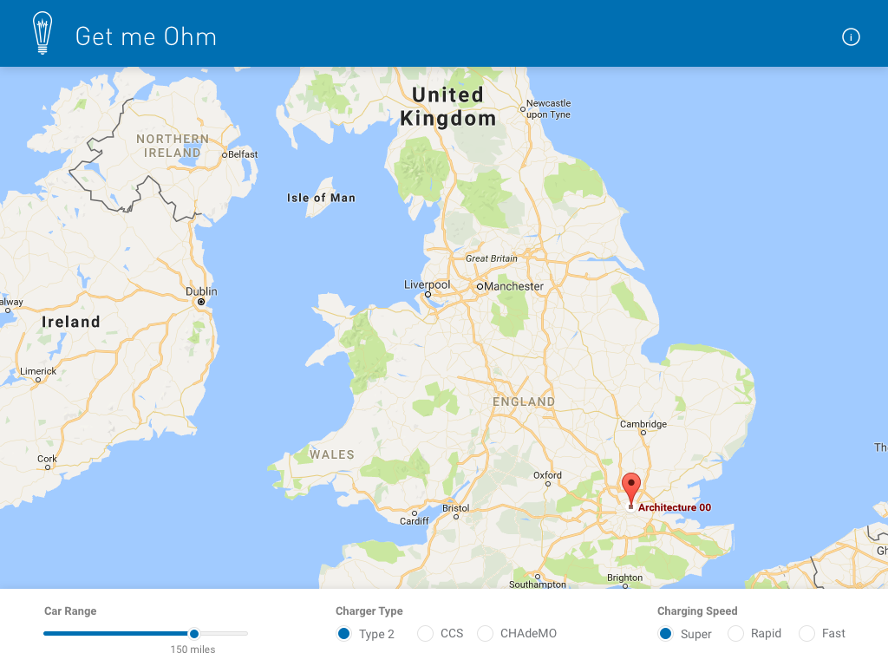
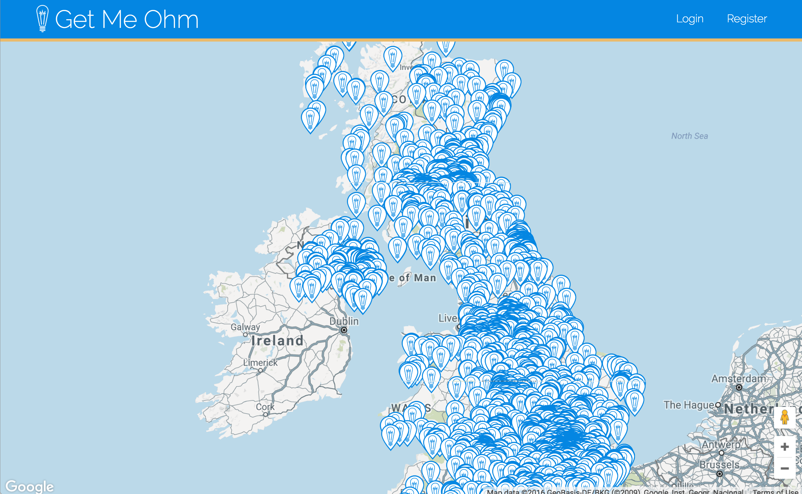

# Get Me Ohm

###GA WDI22 - Project 2

#### Electric Charging Network Map

#####[See it here](https://powerful-falls-66955.herokuapp.com/)

#####Wireframe

#####Outline
Get Me Ohm is a web app, combining Google Maps API and the Open Charge Network API to show the location of EV(Electric Vehicle) charging stations throughout the UK and N.I.

####Functionality
Register and Login using JWT, Find user via geolocation, origin and destination route mapping using Google Directions.

Future Additions - Charging Waypoints, Charger Type selection.

####The build
* HTML5, CSS3, BootStrap, JS, jQuery, ES6, JWT
* Google Maps API, Google Directions, Geolocation and Open Charge Map API 
* Google Fonts - RaleWay
* SnazzyMaps

#### Challenges

Google Directions took a long time to impliment. As did Geo-location.  I feel I should be further along with my knowledge of JS than I am at this point, and required too much help to complete the project.
I also feel that my app lacks the functionality it needs, but given a few more days (possibly a week) I think I could impliment charger selection and way points. Possibly information on each charger via a modal pop-up when a map marker is clicked.

